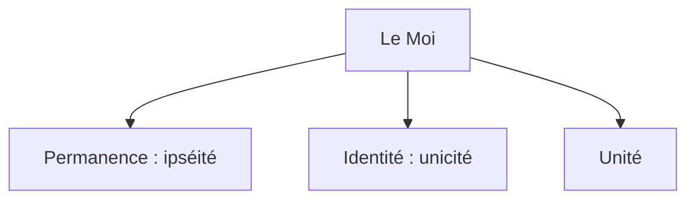

# 2. Qu'est-ce qui fait de moi une seule et même personne ?
{: .no_toc }

  

    Sommaire
  

  {: .text-delta }
- TOC
{:toc}

## Les caractéristiques du moi

{: .note-title }
> Le "MOI" et ses trois dimensions
>
> Le moi, d'un point de vue psychologique, se caractérise par :
>1. La **permanence** (ou **ipséité** : je reste moi-même malgré les changements dûs au temps qui passe)
> 2. L'**identité** (ou **unicité** : je suis moi-même, je suis unique, je ne me confonds pas avec autrui)
>3. L'**unité** du moi (je suis "un" et pas deux ou trois en moi-même, ne suis qu'une seule personne)
>
> La question du moi est donc triple :
  - **Problème de la permanence ou de l'ipséité** : suis-je le même à travers le temps ?
  - **Problème de l'identité ou de l'unité** : suis-je unique, qu'est-ce qui me distingue d'autrui ? 
  - **Problème de l'unité** : suis-je une seule et même personne, ou puis-je être double ? 

### Complément : Qui suis-je ? Une quête philosophique - Amy Adkins

<iframe src="https://embed.ted.com/talks/lang/fr/amy_adkins_who_am_i_a_philosophical_inquiry" width="640" height="480" style="position:absolute;left:0;top:0;width:87%;height:87%" frameborder="0" scrolling="no" allowfullscreen></iframe>

## Extraits de John Locke, *Essai sur l’entendement humain*, livre II, chap. 27 (1690)

### Suis-je toujours la même personne ?

{: .note-title }
> Lire et répondre
> 
> Sur quoi repose l'identité de notre personne à travers le temps ?

| John Locke, Texte n°1 - « La conscience fait la même personne »                     |
| ------------------------------------------------------------ |
| *La conscience fait la même personne*. On voit que la même substance immatérielle ou âme ne suffit pas, où qu’elle soit située et quel que soit son état, à faire à elle seule le même homme. En revanche il est manifeste que la simple conscience, aussi loin qu’elle peut atteindre, même si c’est à des époques historiques passées, réunit des existences et des actions éloignées dans le temps au sein de la même personne aussi bien qu’elle le fait pour l’existence et les actions du moment immédiatement précédent. En sorte que tout ce qui a la conscience d’actions présentes et passées est la même personne à laquelle elles appartiennent ensemble. Si j’avais conscience d’avoir vu l’Arche et le Déluge de Noé comme j’ai conscience d’avoir vu une crue de la Tamise l’hiver dernier, ou comme j’ai conscience maintenant d’écrire, je ne pourrais pas plus douter que moi qui écris ceci maintenant, qui ai vu la Tamise déborder l’hiver dernier, et qui aurais vu la terre noyée par le Déluge, j’étais le même soi ou moi-même que j’étais hier, tandis qu’à présent j’écris (que je sois entièrement constitué ou non de la même substance, matérielle ou immatérielle). Car pour ce qui est de la question de savoir si je suis le même soi, il importe peu que ce soi d’aujourd’hui soit fait de la même substance ou d’autres. |

### Puis-je être quelqu'un d'autre ?

{: .note-title }
> Lire et répondre
>
> 1. Ecrivez-une courte fiction qui mette en scène l'expérience de pensée proposée par Locke (choisissez d'autres personnages)
> 2. En quoi cette expérience de pensée permet-elle de différencier "l'homme" de la "personne" ?
> 3. En quoi montre-t-elle que l'identité de la personne repose sur la conscience ?

| John Locke, Texte n° 2 - Le prince et le savetier                        |
| ------------------------------------------------------------ |
| Que l’âme d’un prince, emportant avec elle la conscience de sa vie passée de prince, venait à entrer dans le corps d’un savetier et à s’incarner en lui à peine celui-ci abandonné par son âme, chacun voit bien qu’il serait la même personne que ce prince, et responsable seulement de ses actes : mais qui dirait que c’est le même homme ? Le corps lui aussi entre dans la constitution de l’homme, tandis que l’âme, avec toutes ses pensées princières, ne ferait pas un autre homme, mais il demeurerait le même savetier pour tous, sauf pour lui-même. |

#### Complément n°1 : greffer un cerveau dans un autre corps ?

{: .highlight }
> Quels problèmes poseraient ces expérimentations de Robert J. White si elles étaient réellement mises en œuvre sur des êtres humains ?

| Extrait de *Philosophie et Science-Fiction*, Collectif, Vrin, 2000 |      
| ------------------------------------------------------------ | 
| En 1963, Robert J. White, à Cleveland, entreprit une expérience d'un goût douteux. Avec ses assistants, il était parvenu à exciser un cerveau de singe hors de sa boîte crânienne et à le faire vivre sous circulation artificielle pendant quelques heures. L'électro-encéphalogramme révélait une activité électrique proche de la normale. Le cerveau semblait avoir conservé ses fonctions. A la même époque, d'autres chirurgiens rendirent compte d'expériences analogues dans lesquelles des cerveaux de chiens décapités étaient maintenus artificiellement en état de fonctionnement. L'équipe de White ne s'arrêta pas en si bon chemin. Les cerveaux de singes furent bientôt greffés sur des corps de singes préalablement décapités. Les cerveaux greffés pouvaient ainsi être maintenus en activité pendant quelques jours. White ne se souciait sans doute pas des implications philosophiques de ses expériences. Mais, lors d'une interview donnée à la télévision en 1966, il affirma sans détour qu'il serait possible de greffer un cerveau humain de la même manière. |  

<iframe width="560" height="315" src="https://www.youtube.com/embed/_Goq-J96pIw?si=qEik23B2Qwwy-nlB" title="YouTube video player" frameborder="0" allow="accelerometer; autoplay; clipboard-write; encrypted-media; gyroscope; picture-in-picture; web-share" referrerpolicy="strict-origin-when-cross-origin" allowfullscreen></iframe>

#### Complément n°2 : Philip K. Dick

{: .highlight }
> Comparez l'expérience de pensée de J. Locke et l'extrait de la nouvelle de Philip K. Dick, et montrez quelle thèse cela permet d'illustrer.
>
>> -  [Facultatif : lire la nouvelle en entier](../../docs/S1L1/S1L1-3-1.html)  
>> - [Voir un extrait de l'adaptation cinématographique](../../docs/S1L1/S1L1-3-2.html)  

| "Souvenirs à vendre" (Philip K. Dick)           |
| ------------------------------------------------------------ |
| **<u>Résumé</u> : Douglas Quail rêve d'aller un jour sur Mars, mais ses revenus ne le lui permettent pas. Il se rend donc chez *Rekal Inc.*, une société qui implante de faux souvenirs. Le gérant, McClane, lui propose de lui implanter des souvenirs d'un  voyage de deux semaines sur Mars en tant qu'agent secret. Après l'opération, il aura complètement oublié qu'il s'agit de faux souvenirs.** |
| « Asseyez-vous, Douglas », enjoignit McClane en agitant sa main grassouillette pour désigner une chaise faisant face au bureau. « Alors comme ça, vous voulez être allé sur Mars. C’est parfait. » Quail s’assit, un peu tendu. « Je ne suis pas très sûr que cela vaille le prix demandé, déclara-t-il. Ça coûte très cher, et autant que je sache, je ne reçois rien en échange. » Ça coûte presque autant que d’y aller pour de vrai, songea-t-il. (...) « Vous serez convaincu d’y être allé, ne vous en faites pas. Vous ne vous souviendrez ni de nous, ni de cette entrevue, ni de votre passage ici. Dans votre mémoire, ce sera un vrai voyage ; nous vous le garantissons. Quinze jours de souvenirs, remémorés dans le moindre détail. N’oubliez jamais ceci : si un jour vous doutiez d’avoir réellement effectué un séjour prolongé sur Mars, revenez et vous serez intégralement remboursé. Vous voyez ! — Seulement voilà : je n’y suis pas allé, insista Quail. Je n’y serai pas allé quelles que soient les preuves que vous me fournirez. » Il prit une profonde inspiration saccadée. « Et je n’ai jamais été un agent secret d’Interplan. » (...) « Mr. Quail, reprit patiemment McClane. Comme vous nous l’avez expliqué dans votre lettre, vous n’avez pas la moindre chance d’aller un jour sur Mars ; vous n’en avez pas les moyens et, beaucoup plus important, vous ne présentez pas les qualités requises pour être agent secret chez Interplan ou ailleurs. Ce que nous vous proposons est donc la seule manière de réaliser… hum, le rêve de votre vie. Est-ce que je me trompe ? Non, vous ne pouvez ni être agent secret ni vous rendre pour de vrai sur Mars. » Il gloussa. « Mais vous pouvez l’avoir été et y être allé. Nous nous en chargerons. Et notre tarif est raisonnable, sans mauvaises surprises. » Il eut un sourire encourageant. — Le souvenir extra-factuel est-il à ce point convaincant ? interrogea Quail. — Plus vrai qu’un vrai. Si vous étiez vraiment allé sur Mars comme agent d’Interplan, à l’heure actuelle vous auriez oublié la quasi-totalité de votre mission ; nos analyses du système vérimémoriel – la remémoration authentique des grands événements de la vie – démontrent qu’une foule de détails s’évanouissent très rapidement. Et définitivement. Dans le contrat global que nous offrons, les souvenirs sont si profondément implantés que rien n’est oublié. Le matériau qu’on vous injecte pendant votre coma artificiel a été créé par des experts remarquablement formés qui ont passé des années sur Mars ; dans tous les cas, nous vérifions tout dans les moindres détails. » |

### Puis-je être deux personnes ou plus en une seule ?

{: .note-title }
> Lire et répondre
>
> 1. Expliquez les deux cas proposés par J. Locke dans cette expérience de pensée
> 2. Pourquoi Socrate éveillé et Socrate endormi ne sont-ils pas la même personne selon Locke ?
> 3. Qu’est-ce qui permet au Moi de demeurer le même ?
> 4. Locke condamnerait-il les actes du docteur Jekyll et pourquoi ?

| John Locke, Texte n° 3 - Socrate et le maire de Quinborough              |
| ------------------------------------------------------------ |
| Ceci peut nous faire voir en quoi consiste l’identité personnelle : non dans l’identité de substance mais, comme je l’ai dit, dans l’identité de conscience, en sorte que si Socrate et l’actuel maire de Quinborough (1) en conviennent, ils sont la même personne, tandis que si le même Socrate éveillé et endormi ne partagent pas la même conscience, Socrate éveillé et Socrate dormant n’est pas la même personne. Et punir Socrate l’éveillé pour ce que Socrate le dormant a pu penser, et dont Socrate l’éveillé n’a jamais eu conscience, ne serait pas plus juste que de punir un jumeau pour les actes de son frère jumeau et dont il n’a rien su, sous prétexte que leur forme extérieure est si semblable qu’ils sont indiscernables (or on a vu de tels jumeaux).  *(1) Quinborough : ville du sud-est de l’Angleterre.* |

#### Prolongement : Dr Jekyll § Mr Hide

{: .note-title }
> **Robert Louis Stevenson**, *L’étrange cas du dr Jekyll et de mr Hyde* (1885)
>
>Ce roman célèbre publié en 1885 raconte l'histoire du docteur Henry Jekyll, un scientifique qui crée une potion pour séparer ses bons côtés de ses mauvais. Cette potion le transforme en Edward Hyde, une figure maléfique qui commet des actes violents. Le notaire Gabriel John Utterson, ami de Jekyll, enquête sur la relation entre Jekyll et Hyde, découvrant que Jekyll perd le contrôle de ses transformations. Les actes de Hyde deviennent de plus en plus incontrôlables, culminant avec le meurtre de Sir Danvers Carew. Jekyll est finalement piégé dans son identité de Hyde, menant à une fin tragique où il se suicide. 
>
> -> [Voir des extraits d'adaptations cinématographiques](../../docs/S1L1/S1L1-3-3.html)  

