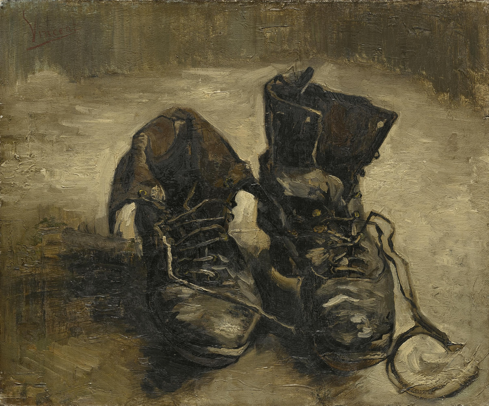

# 2. L'amour, un sentiment indicible ?
{: .no_toc }

  

    Sommaire
  

  {: .text-delta }
- TOC
{:toc}

## Textes

| Henri Bergson, *Essai sur les données immédiates de la conscience* (1889) |
| ------------------------------------------------------------ |
| Chacun de nous a sa manière d’aimer et de haïr, et cet amour, cette haine, reflètent sa personnalité tout entière. Cependant le langage désigne ces états par les mêmes mots chez tous les hommes ; aussi n’a-t-il pu fixer que l’aspect objectif et impersonnel de l’amour, de la haine, et des mille sentiments qui agitent l’âme. Nous jugeons du talent d’un romancier à la puissance avec laquelle il tire du domaine public, où le langage les avait ainsi fait descendre, des sentiments et des idées auxquels il essaie de rendre, par une multiplicité de détails qui se juxtaposent, leur primitive et vivante individualité. Mais de même qu’on pourra intercaler indéfiniment des points entre deux positions d’un mobile sans jamais combler l’espace parcouru, ainsi, par cela seul que nous parlons, par cela seul que nous associons des idées les unes aux autres et que ces idées se juxtaposent au lieu de se pénétrer, nous échouons à traduire entièrement ce que notre âme ressent : la pensée demeure incommensurable avec le langage. |
| *1. Qu'est-ce que les mots échouent à exprimer du sentiment d'amour ?* *2. Pourquoi le romancier parvient-il pourtant à exprimer l'amour ? En quoi cela s'oppose-t-il à ce que pense Hegel ?* 3. *Expliquez la dernière phrase : « la pensée demeure incommensurable avec le langage »* |

| Henri Bergson, *Le rire* (1900)                              |
| ------------------------------------------------------------ |
| Nous ne voyons pas les choses mêmes ; nous nous bornons, le plus souvent, à lire des étiquettes collées sur elles. Cette tendance, issue du besoin, s’est encore accentuée sous l’influence du langage. Car les mots (à l’exception des noms propres) désignent des genres. Le mot, qui ne note de la chose que sa fonction la plus commune et son aspect banal, s’insinue entre elle et nous […]. Et ce ne sont pas seulement les objets extérieurs, ce sont aussi nos propres états d’âme qui se dérobent à nous dans ce qu’ils ont d’intime, de personnel, d’originalement vécu. Quand nous éprouvons de l’amour ou de la haine, quand nous nous sentons joyeux ou tristes, est-ce bien notre sentiment lui-même qui arrive à notre conscience avec les mille nuances fugitives et les mille résonances profondes qui en font quelque chose d’absolument nôtre ? Nous serions alors tous romanciers, tous poètes, tous musiciens. Mais, le plus souvent, nous n’apercevons de notre état d’âme que son déploiement extérieur. Nous ne saisissons de nos sentiments que leur aspect impersonnel, celui que le langage a pu noter une fois pour toutes parce qu’il est à peu près le même dans les mêmes conditions, pour tous les hommes. Ainsi, jusque dans notre propre individu, l’individualité nous échappe. |
| *Expliquez quel est le défaut du langage qui l'empêche d'exprimer les sentiments.* |

| Henri Bergson, *Conférence de Madrid sur l'âme humaine* (1915) |
| ------------------------------------------------------------ |
| Qu'est-ce que l'artiste ? C'est un homme qui voit mieux que les autres car il regarde la réalité nue et sans voile. Voir avec des yeux de peintre, c'est voir mieux que le commun des mortels. Lorsque nous regardons un objet, d'habitude, nous ne le voyons pas : parce que ce que nous voyons, ce sont des conventions interposées entre l'objet et nous ; ce que nous voyons, ce sont des signes conventionnels qui nous permettent de reconnaître l'objet et de le distinguer pratiquement d'un autre, pour la commodité de la vie. Mais celui qui mettra le feu à toutes ces conventions, celui qui méprisera l'usage pratique et les commodités de la vie et s'efforcera de voir directement la réalité même, sans rien interposer entre elle et lui, celui-là sera un artiste. |
| *1. Expliquez en quoi l'artiste est « un homme qui voit mieux que les autres »* 2. *Choisissez une œuvre d'art que vous appréciez et expliquez en quoi l'artiste y parvient à exprimer ce que les mots ne peuvent pas dire.* |

## Deux exemples pour illustrer les thèses de Bergson

### Vincent Van Gogh

|  | 
|  *Vieux Souliers aux lacets* (Vincent Van Gogh, 1886)  |

### Pierre Schaeffer 

**"Études de bruits" (musique concrète ou "acousmatique")**

<iframe width="560" height="315" src="https://www.youtube.com/embed/CTf0yE15zzI?si=qMHy0rXdVQuHFMMs" title="YouTube video player" frameborder="0" allow="accelerometer; autoplay; clipboard-write; encrypted-media; gyroscope; picture-in-picture; web-share" allowfullscreen></iframe>

