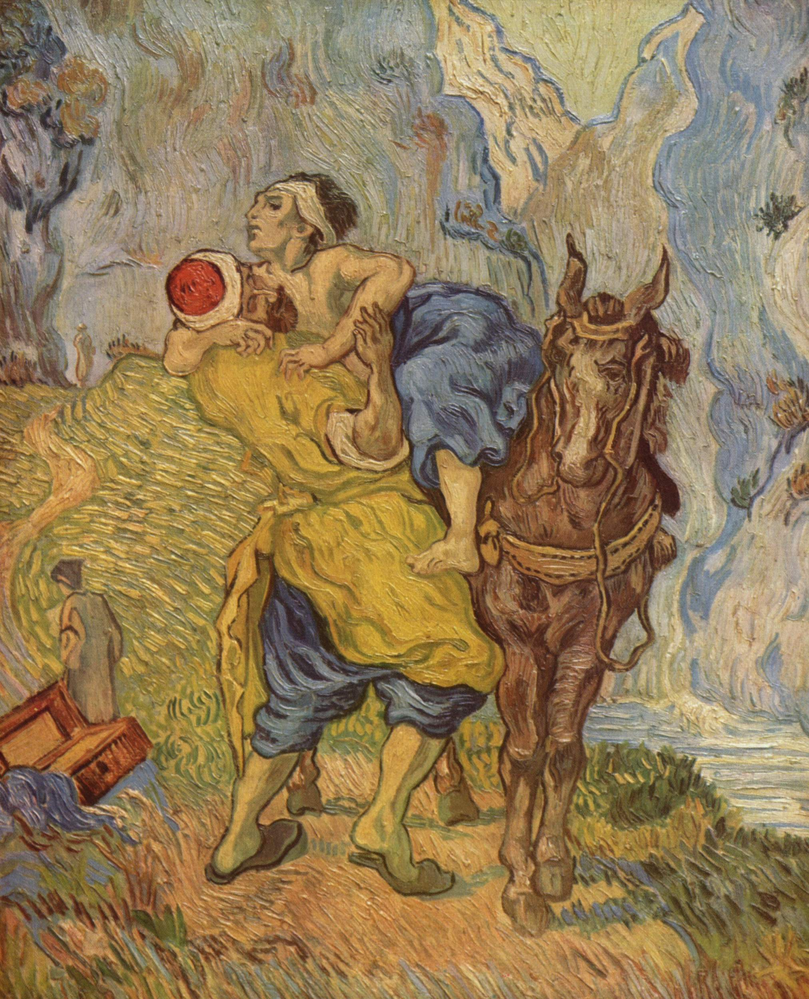
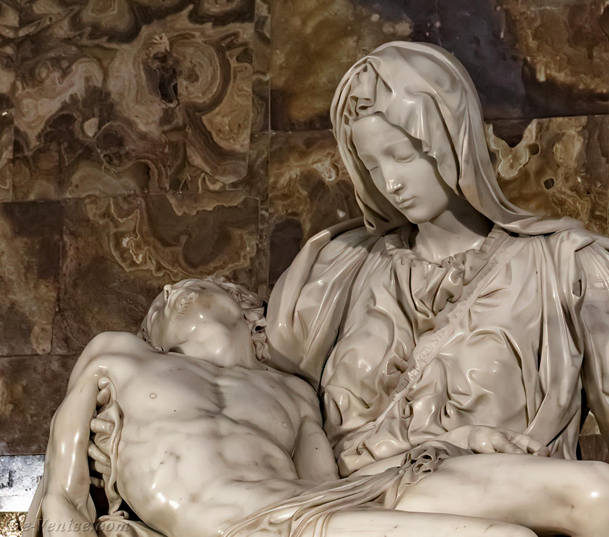
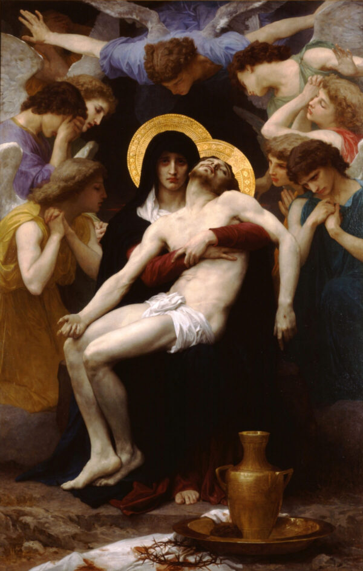
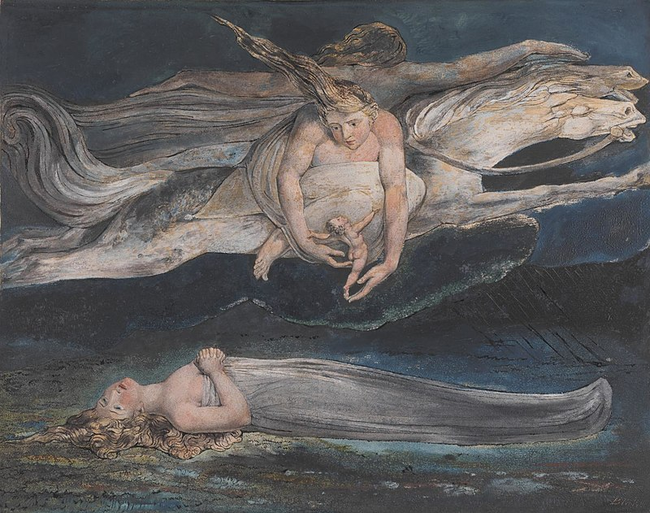

# Introduction : La pitié dans l'art

{: .important-title }
> Exercice
>
>En vous inspirant des textes et œuvres d'art suivants, formulez une définition de la pitié la plus complète possible.

| Vincent Van Gogh, *Le bon samaritain* (1890)                 | *La parabole du bon Samaritain* (Évangile selon Luc)         |
| ------------------------------------------------------------ | ------------------------------------------------------------ |
|  | Il y avait un homme qui descendait de Jérusalem à Jéricho, quand il fut attaqué par des brigands. Ils lui arrachèrent ses vêtements, le rouèrent de coups et s’en allèrent, le laissant à moitié mort.  Or il se trouva qu’un prêtre descendait par le même chemin. Il vit le blessé et, s’en écartant, poursuivit sa route.  De même aussi un lévite (1) arriva au même endroit, le vit, et, s’en écartant, poursuivit sa route. Mais un Samaritain (2) qui passait par là arriva près de cet homme. En le voyant, il fut pris de compassion. Il s’approcha de lui, soigna ses plaies avec de l’huile et du vin, et les recouvrit de pansements. Puis, le chargeant sur sa propre mule, il l’emmena dans une auberge où il le soigna de son mieux. Le lendemain, il sortit deux pièces d’argent, les remit à l’aubergiste et lui dit : « Prends soin de cet homme, et tout ce que tu auras dépensé en plus, je te le rembourserai moi-même quand je repasserai. » Et Jésus ajouta :  – A ton avis, lequel des trois s’est montré le prochain de l’homme qui avait été victime des brigands ? – C’est celui qui a eu compassion de lui.    *(1) Lévites : communauté juive au service du temple pour remplir des offices annexes au culte, sans avoir accès à l'autel. (2) Samaritains : communauté juive qui était originaire de Samarie, région de Palestine située dans l'actuelle Syrie.* |

| Michel-Ange, *Pietà* (1498–1499)   |  William Adolphe Bouguereau, *La Pietà* (1876)     |
| -------------------------------  | ------------------------------- |
|  |  |

| La Pietà, ou Vierge de Pitié, est un thème récurrent de l’iconographie chrétienne. Il s’agit de la représentation de la Vierge au pied de la Croix tenant son fils mort dans ses bras, autrement nommée *Mater dolorosa*. Le mot « pietà », peut être traduit par « compassion » et illustre l’amour de Marie pour son enfant. La Pietà la plus célèbre est celle de **Michel-Ange**, sculptée dans du marbre et que l'on trouve à la Basilique Saint-Pierre de Rome. Le peintre français **William Bouguereau**, archétype de l’artiste académique, peint une Pietà en 1876, suite à la mort de son fils aîné. Marie, vêtue de noir, au centre de la composition, pleure son enfant. Tenant fermement son corps sans vie, elle fixe le spectateur les yeux remplis de douleurs. Les deux personnages ont une auréole dorée, symbole de leur divinité. |

| William Shakespeare, *Macbeth* (1606)  | William Blake, *La pitié* (1795)    |
| --------------------- | -------------------------- |
| Et alors, la Pitié, pareille à un nouveau-né tout nu  Chevauchant l'ouragan, ou à des chérubins célestes,  Montés sur les coursiers invisibles de l'air,  Soufflera l'atroce forfait dans tous les yeux,  Tant et si bien que les larmes noieront le vent. |  |