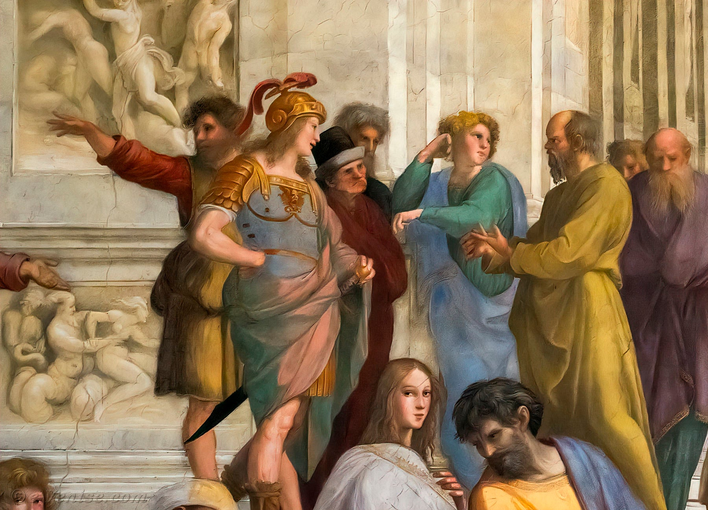

# 2. La pitié, une faiblesse ou une vertu morale ?
{: .no_toc }

  

    Sommaire
  

  {: .text-delta }
- TOC
{:toc}

## Exercice oral évalué 

{: .note-title }
> Colloque des philosophes : Doit-on avoir pitié ?  
>
> 
> *L'école d'Athène (détail), Raphaël, XVIe s.*
> 
>
> **La classe est divisée en deux équipes. Chacune défendra l'une des thèses suivantes :**  
> - La pitié est une faiblesse.   
> - La pitié est une vertu morale.  
> 
> **Préparation en équipe** (utiliser le tableau en p. 6 de la fiche-leçon) :  
> 1. Vous vous distribuez les rôles (Penseurs : Nietzsche, Baudelaire, Schopenhauer, Rousseau, et leurs assistants) et faites des pancartes.  
> 2. Vous formulez précisément la thèse que vous allez défendre.  
> 3. Vous formulez le problème de la discussion. Utilisez les éléments de l’introduction de la leçon et cherchez sur quoi repose l’opposition entre votre réponse et celle de l’équipe adverse.  
> 4. Chaque équipe se divise ensuite en deux groupes : un groupe lit les textes en faveur de sa thèse, y cherche des arguments et des exemples et en ajoute d'autres ; l'autre groupe lit les textes de l'équipe adverse et cherche comment les réfuter, avec quels contre-arguments.  
> 5. Les deux groupes de chaque équipe se rassemblent et font le point. Chacun résume son travail. Les élèves déterminent l'ordre de passage dans le colloque (le premier devra présenter la question et le problème) et cherchent à répondre aux probables contre-arguments de l'équipe adverse.  
>   
> **Colloque** :   
> 1. L'équipe qui lancera la discussion est tirée au sort. Un élève de cette équipe présente la question et formule le problème. L'autre équipe peut répondre, ou préciser le sens de la question et le problème.  
> 2. Un élève de l'équipe formule la thèse et développe un premier argument. Les élèves de l'autre équipe peuvent ensuite lui répondre pour le réfuter et présenter un contre-argument. Lorsque la discussion autour de l'argument est terminée, l'autre équipe présente à son tour son argument. Etc.  
>   
> **Évaluation** : note de groupe /5 (préparation, concertation, organisation) et individuelle /5 (qualité des arguments, qualité de la prestation orale, répartie + synthèse finale)
  

## 2.1. La pitié, une faiblesse

### Critique de la compassion chrétienne

| TEXTE N°1 : Friedrich Nietzsche, *L’antéchrist* (1895)       |
| ------------------------------------------------------------ |
| On appelle le christianisme la religion de la pitié. – La pitié se trouve en contradiction avec les émotions toniques, celles qui haussent l’énergie du sentiment vital : elle exerce une action dépressive. On perd de la force quand on compatit. (...). Voilà le premier point de vue ; mais il en existe un autre, encore plus important. Si l’on mesure la pitié à la valeur des réactions qu’elle suscite ordinairement, elle se caractérise alors bien plus clairement comme une menace sur la vie. En gros, la pitié traverse la loi de l’évolution, qui est celle de la sélection. Elle conserve ce qui est mûr pour le déclin, elle se défend pour le bien des déshérités et des damnés de la vie (...). On a osé appeler vertu la compassion (...) ; on est allé plus loin, on a fait d’elle la vertu, le sol et la source de toute vertu. |
| *1. Cherchez dans le texte : La thèse, le ou les arguments, le ou les exemples 2. Cherchez des arguments pour réfuter la thèse et les arguments de ce texte* |

### La pitié, une fausse conception du bonheur

| TEXTE N°2 : Friedrich Nietzsche, *Le gai savoir*, Livre IV (1882) |
| ------------------------------------------------------------ |
| **§ 338 - La volonté de vie et les compatissants**.  Est-il salutaire pour vous d’être avant tout des hommes compatissants ? Est-il salutaire pour ceux qui souffrent que vous compatissiez ? (...) Dans la plupart des bienfaits que l’on prodigue aux malheureux il y a quelque chose de révoltant, à cause de l’insouciance intellectuelle que le compatissant met à jouer à la destinée : il ne sait rien de toutes les conséquences et de toutes les complications intérieures qui, pour *moi*, ou bien pour *toi* s’appellent malheur ! Toute l’économie de mon âme, son équilibre par le « malheur », les nouvelles sources et les besoins nouveaux qui éclatent, les vieilles blessures qui se ferment, les époques entières du passé qui sont refoulées — tout cela, tout ce qui peut être lié au malheur, ne préoccupe pas ce cher compatis­sant, il veut *secourir* et il ne pense pas qu’il existe une nécessité personnelle du malheur, que, toi et moi, nous avons autant besoin de la frayeur, des privations, de l’appauvrissement, des veilles, des aventures, des risques, des méprises que de leur contraire, et même, pour m’exprimer d’une façon mystique, que le sentier de notre propre ciel traverse toujours la volupté de notre propre enfer. Non, il ne sait rien de tout cela : la « religion de la pitié » ou bien « le cœur » ordonne de secourir, et l’on croit avoir le mieux aidé lorsque l’on a aidé vite ! Si, vous autres partisans de cette religion, professez vraiment, à l’égard de vous-mêmes, un sentiment pareil à celui que vous avez à l’égard de votre prochain, si vous ne voulez pas garder sur vous-mêmes, pendant une heure, votre propre souf­france, prévenant toujours de loin tout malheur imagina­ble, si vous considérez en général la douleur et la misère comme mauvaises, haïssables, dignes d’être détruites, comme une tare de la vie, eh bien alors ! outre votre religion de la pitié, vous avez encore au cœur une autre religion, et celle-ci est peut-être la mère de celle-là — la religion du *bien-être*. Hélas ! combien peu vous connaissez le *bonheur* des hommes, êtres commodes et bonasses ! — car le bonheur et le malheur sont des frères jumeaux qui grandissent ensemble, ou bien qui, comme chez vous, *restent petits !* |
| *1. Cherchez dans le texte : La thèse, le ou les arguments, le ou les exemples 2. Cherchez des arguments pour réfuter la thèse et les arguments de ce texte* |

### La pitié, un manque de respect

| TEXTE N°3 : Charles Baudelaire, *Assommons les pauvres*, (Petits Poèmes en prose, Les Paradis artificiels, 1869) |
| ------------------------------------------------------------ |
| Pendant quinze jours je m’étais confiné dans ma chambre, et je  m’étais entouré des livres à la mode dans ce temps-là (il y a seize ou  dix-sept ans) ; je veux parler des livres où il est traité de l’art de  rendre les peuples heureux, sages et riches, en vingt-quatre heures.  J’avais donc digéré, — avalé, veux-je dire, — toutes les élucubrations  de tous ces entrepreneurs de bonheur public, — de ceux qui conseillent à tous les pauvres de se faire esclaves, et de ceux qui leur persuadent qu’ils sont tous des rois détrônés. — On ne trouvera pas surprenant que  je fusse alors dans un état d’esprit avoisinant le vertige ou la  stupidité. Il m’avait semblé seulement que je sentais, confiné au fond de  mon intellect, le germe obscur d’une idée supérieure à toutes les  formules de bonne femme dont j’avais récemment parcouru le dictionnaire. Mais ce n’était que l’idée d’une idée, quelque chose d’infiniment  vague. Et je sortis avec une grande soif. Car le goût  passionné des mauvaises lectures engendre un besoin proportionnel du grand air et des rafraîchissants. Comme j’allais entrer dans un cabaret, un mendiant me tendit son  chapeau, avec un de ces regards inoubliables qui culbuteraient les  trônes, si l’esprit remuait la matière, et si l’œil d’un magnétiseur faisait mûrir les raisins. En même temps, j’entendis une voix qui chuchotait à mon oreille,  une voix que je reconnus bien ; c’était celle d’un bon Ange, ou d’un bon Démon, qui m’accompagne partout. Puisque Socrate avait son bon Démon,  pourquoi n’aurais-je pas mon bon Ange, et pourquoi n’aurais-je pas  l’honneur, comme Socrate, d’obtenir mon brevet de folie, signé du subtil Lélut et du bien-avisé Baillarger ? Il existe cette différence entre le Démon de Socrate et le mien,  que celui de Socrate ne se manifestait à lui que pour défendre, avertir, empêcher, et que le mien daigne conseiller, suggérer, persuader. Ce  pauvre Socrate n’avait qu’un Démon prohibiteur ; le mien est un grand  affirmateur, le mien est un Démon d’action, ou Démon de combat. Or, sa voix me chuchotait ceci : « *Celui-là seul est l’égal d’un  autre, qui le prouve, et celui-là seul est digne de la liberté, qui sait la conquérir.* » Immédiatement, je sautai sur mon mendiant. D’un seul coup de  poing, je lui bouchai un œil, qui devint, en une seconde, gros comme une balle. Je cassai un de mes ongles à lui briser deux dents, et comme je  ne me sentais pas assez fort, étant né délicat et m’étant peu exercé à la  boxe, pour assommer rapidement ce vieillard, je le saisis d’une main par le collet de son habit, de l’autre, je l’empoignai à la gorge, et je me mis à lui secouer vigoureusement la tête contre un mur. Je dois avouer  que j’avais préalablement inspecté les environs d’un coup d’œil, et que  j’avais vérifié que dans cette banlieue déserte je me trouvais, pour un  assez long temps, hors de la portée de tout agent de police. Ayant ensuite, par un coup de pied lancé dans le dos, assez  énergique pour briser les omoplates, terrassé ce sexagénaire affaibli,  je me saisis d’une grosse branche d’arbre qui traînait à terre, et je le battis avec l’énergie obstinée des cuisiniers qui veulent attendrir un beefteack. Tout à coup, — ô miracle ! ô jouissance du philosophe qui vérifie l’excellence de sa théorie ! — je vis cette antique carcasse se  retourner, se redresser avec une énergie que je n’aurais jamais  soupçonnée dans une machine si singulièrement détraquée, et, avec un  regard de haine qui me parut de *bon augure,* le malandrin décrépit se jeta sur moi, me pocha les deux yeux, me cassa quatre dents, et avec la même branche d’arbre me battit dru comme plâtre. — Par mon énergique médication, je lui avais donc rendu l’orgueil et la vie. Alors, je lui fis force signes pour lui faire comprendre que je considérais la discussion comme finie, et me relevant avec la satisfaction d’un sophiste du Portique, je lui dis : « Monsieur, *vous êtes mon égal !* veuillez me faire l’honneur de partager avec moi ma bourse ; et  souvenez-vous, si vous êtes réellement philanthrope, qu’il faut  appliquer à tous vos confrères, quand ils vous demanderont l’aumône, la  théorie que j’ai eu la *douleur* d’essayer sur votre dos. » Il m’a bien juré qu’il avait compris ma théorie, et qu’il obéirait à mes conseils. |
| *1. Cherchez dans le texte : La thèse, le ou les arguments, le ou les exemples 2. Cherchez des arguments pour réfuter la thèse et les arguments de ce texte* |

#### Complément : lecture du poème de baudelaire

<iframe width="560" height="315" src="https://www.youtube.com/embed/YdpEUcJtEgk?si=RAWmgCFzdsCmyod5" title="YouTube video player" frameborder="0" allow="accelerometer; autoplay; clipboard-write; encrypted-media; gyroscope; picture-in-picture; web-share" allowfullscreen></iframe>

## 2. La pitié, une vertu naturelle

### La pitié, principe de la moralité

| TEXTE N°1 : Arthur Schopenhauer, *Le* *Fondement de la morale* (1840) |
| ------------------------------------------------------------ |
| Il n'est rien qui soulève jusque dans ses profondeurs notre sentiment moral autant que la cruauté. Toute autre faute, nous pouvons la pardonner ; la cruauté, jamais. La raison en est que la cruauté est précisément le contraire de la pitié. Venons-nous à apprendre quelque acte de cruauté, comme est celui-ci dont les journaux viennent de nous apporter la nouvelle, d’une mère qui a tué son petit garçon, un enfant de cinq ans, en lui versant dans le gosier de l’huile bouillante, et son autre enfant, plus petit encore, en l'enterrant tout vif ; ou cet autre, qu’on nous annonce d’Alger : une dispute suivie de rixe entre un Espagnol et un Algérien, et où celui-ci ayant eu le dessus, brisa à son adversaire la mâchoire inférieure, la lui arracha net, et s'en alla avec ce trophée,  laissant là l’autre qui vivait encore ; — aussitôt nous voilà saisis d’horreur ; nous nous écrions :  « comment peut-on faire de pareilles choses ? » Et quel est le sens de cette question ? Celui-ci peut-être : Comment peut-on redouter aussi peu les châtiments de la vie future ? — L’interprétation est difficile à admettre. — Ou bien celui-ci : Comment peut-on agir d'après une maxime aussi peu propre à devenir la loi générale de tous les êtres  raisonnables ?  — Pour cela,  non. — Ou bien encore : Comment peut-on négliger à ce point sa propre perfection et celle d'autrui ? — Pas davantage. — Le sens vrai, le voici à n’en pas douter : Comment peut-on être à ce point sans pitié ? C’est donc quand une action s'écarte extrêmement de la pitié, qu’elle porte comme un stigmate le caractère d'une chose moralement condamnable, méprisable. La pitié est par excellence le ressort de la moralité. |
| *1. Cherchez dans le texte : La thèse, le ou les arguments, le ou les exemples 2. Cherchez des arguments pour réfuter la thèse et les arguments de ce texte* |

### Amour de soi et amour-propre

| TEXTE N°2 : L'amour de soi et l'amour-propre chez Jean-Jacques Rousseau |
| ------------------------------------------------------------ |
| Il ne faut pas confondre l'amour-propre et l'amour de soi-même, deux passions très différentes par leur nature et par leurs effets. L'amour de soi-même est un sentiment naturel qui porte tout animal à veiller à sa propre conservation, et qui, dirigé dans l'homme par la raison et modifié par la pitié, produit l'humanité et la vertu. L'amour-propre n'est qu'un sentiment relatif, factice, et né dans la société, qui porte chaque individu à faire plus de cas de soi que de tout autre, qui inspire aux hommes tous les maux qu'ils se font mutuellement (...). Ceci bien entendu, je dis que, dans notre état primitif, dans le véritable état de nature, l'amour-propre n'existe pas. **Jean-Jacques Rousseau**, *Discours sur l'origine et les fondements de l'inégalité parmi les hommes* (1755) |
| L'amour de soi, qui ne regarde qu'à nous, est content quand nos vrais besoins sont satisfaits ; mais l'amour-propre, qui se compare, n'est jamais content et ne saurait l'être, parce que ce sentiment, en nous préférant aux autres, exige aussi que les autres nous préfèrent à eux ; ce qui est impossible. Voilà comment les passions douces et affectueuses naissent de l'amour de soi, et comment les passions haineuses et irascibles naissent de l'amour-propre. **Jean-Jacques Rousseau**, *Émile ou de l'éducation* (1762) |
| *1. Cherchez dans les textes : La thèse, le ou les arguments, le ou les exemples 2. Cherchez des arguments pour réfuter la thèse et les arguments de ce texte* |

### La pitié, un sentiment naturel à l'origine des vertus sociales

| TEXTES N°3 : Jean-Jacques Rousseau, *Discours sur l'origine et les fondements de l'inégalité parmi les hommes* (1755) |
| ------------------------------------------------------------ |
| Il est donc bien certain que la pitié est un sentiment naturel qui,  modérant dans chaque individu l’activité de l’amour de soi-même,  concourt à la conservation mutuelle de toute l’espèce. C’est elle qui  nous porte sans réflexion au secours de ceux que nous voyons souffrir :  c’est elle qui, dans l’état de nature, tient lieu de lois, de mœurs, et  de vertu, avec cet avantage que nul n’est tenté de désobéir à sa douce  voix : c’est elle qui détournera tout sauvage robuste d’enlever à un faible enfant, ou à un vieillard infirme, sa subsistance acquise avec  peine, si lui-même espère pouvoir trouver la sienne ailleurs : c’est  elle qui, au lieu de cette maxime sublime de justice raisonnée, *Fais à autrui comme tu veux qu’on te fasse*, inspire à tous les hommes cette autre maxime de bonté bien moins naturelle, bien moins parfaite, mais plus utile que la précédente, *Fais ton bien avec le moindre mal d’autrui qu’il est possible*. C’est, en un mot, dans ce sentiment naturel, plutôt que dans des  arguments subtils, qu’il faut chercher la cause de la répugnance que tout homme éprouverait à mal faire, même indépendamment des maximes de  l’éducation. Quoiqu’il puisse appartenir à Socrate et aux esprits de sa  trempe, d’acquérir de la vertu par raison, il y a longtemps que le genre humain ne serait plus, si sa conservation n’eût dépendu que des  raisonnements de ceux qui le composent. |
| De cette seule qualité [la pitié], découlent toutes les vertus sociales […]. En  effet, qu’est-ce que la générosité, la clémence, l’humanité, sinon la pitié appliquée aux faibles, aux coupables, ou à l’espèce humaine en général ? La bienveillance et l’amitié même sont, à le bien prendre, des productions d’une pitié constante, fixée sur un objet particulier : car désirer que quelqu’un ne souffre point, qu’est-ce autre chose que  désirer qu’il soit heureux ? |
| *1. Cherchez dans les textes : La thèse, le ou les arguments, le ou les exemples 2. Cherchez des arguments pour réfuter la thèse et les arguments de ce texte* |