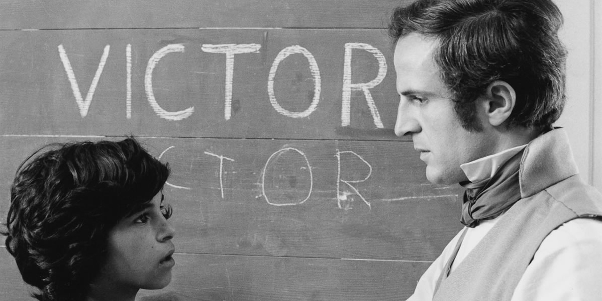

## 1. Film étudié : L'enfant Sauvage
{: .no_toc }

  

    Sommaire
  

  {: .text-delta }
- TOC
{:toc}

### Présentation du film

{: .highlight }
>"*L'Enfant sauvage*" est un film réalisé et joué par François Truffaut, de 1970, et tiré d'un fait réel. Truffaut a écrit le scenario en s'inspirant du "*Mémoire et Rapport sur Victor de l'Aveyron*", de Jean Itard.   
> **<u>Synopsis</u>**. En 1797, des paysans capturent, dans une forêt de l’Aveyron, un enfant abandonné. Cet “enfant sauvage” est recueilli par un médecin, Jean Itard. Il va livrer quotidiennement un véritable combat pour tenter de faire de cet être inférieur à bien des animaux un enfant qui donnera, petit à petit, des signes d'affection, d'intelligence et de sensibilité. 
>
>  

### Problématique et questions

{: .nouveau-title }
> L'ENFANT SAUVAGE (F. TRUFFAUT, 1971)
> 
>Ce film nous interroge sur la question de l'éducation. En partant d'un cas d'école d'enfant sauvage qui ne sait rien de ce que doivent savoir les enfants (parler, écrire, marcher, dormir dans un lit, manger et se tenir à table, etc.), François Truffaut nous montre la difficulté de l'éduquer.  
>
>Après avoir vu ce film, nous pouvons nous demander : **Itard libère-t-il Victor de son ignorance grâce à l'éducation qu'il lui apporte, ou au contraire le contraint-il à devenir un humain comme les autres ? Itard émancipe-t-il Victor, ou se contente-t-il de lui transmettre les fondamentaux de la culture humaine ?**
>
>**<u>Le film pose d'autres questions à propos de la différence entre Nature et Culture</u>** :
>
> - Celle de **la part d'inné et d'acquis en l'homme** : apprend-on tout ? Ou y a-t-il en l'homme des conduites naturelles, instinctives ? L'éducation des enfants consiste-t-elle à réveiller en lui des aptitudes innées ? Ou à lui enseigner, lui faire acquérir des conduites, savoirs et  habitudes artificielles, culturelles ? 
> - **Sommes-nous naturellement sociables ?** Où est la place « naturelle » de Victor : dans la forêt, ou parmi les êtres humains ? Quel est le vrai sens d'une existence humaine ? A-t-on la nécessité de vivre avec autrui ? Se réalise-t-on, est on heureux en société ? 

### Exercice à faire au brouillon pendant la projection

{: .note-title }
> A FAIRE
>
> En vous appuyant sur la description de quelques scènes du film, vous répondrez à la question suivante :
> 
> >**Par son éducation, Itard contraint-il ou libère-t-il Victor ?**
> 
>Vous pouvez faire un tableau à deux colonnes (contrainte / libération) et mettre pendant le visionnage du film les scènes concernées et vos réflexions.

### Textes

| Manuel HLP Terminale "Ellipses"                              |
| ------------------------------------------------------------ |
| François Truffaut, qui interprète lui-même le docteur **Itard** dans le film, voulait faire **un film sur l’enfance et l’éducation**. Il pose la problématique dès le début, en confrontant Itard avec l’aliéniste **Pinel** sur cette question: **<u>l’enfant a-t-il été abandonné parce qu’il était idiot, ce que pense Pinel, ou est-il devenu idiot parce qu’abandonné de tous ?</u>** Itard, qui a la conviction que l’état du jeune enfant vient uniquement de son isolement, entreprend alors de lui faire recouvrer les capacités qui lui manquent. «*Tout ce qu’il fait, il le fait pour la première fois* », s’émerveille-t-il. Or certaines facultés ne pourront plus être acquises. **Victor réussit à apprendre l’alphabet et à écrire certains mots, mais il ne parviendra pas à parler** car il continuera à considérer les mots comme des signes naturels qui accompagnent la chose, et non comme des signes artificiels et conventionnels qui la remplacent. Victor prononce ou écrit le mot « lait » seulement quand on lui en donne, ou quand il s’attend à ce qu’on lui en donne.  Une scène marquante du film est **l’apprentissage du sens de la justice**. Itard veut montrer **<u>la différence entre le dressage, qui consiste à inculquer mécaniquement un comportement par le biais de punitions et de récompenses, et l’éducation, dont le but est de conduire à l’autonomie intellectuelle et morale</u>**. Pour ce faire, Itard invente un dispositif dont il dit lui-même qu’il sera cruel : il punit injustement Victor. Or celui-ci se révolte en le mordant, ce qui montre qu’il a acquis le sens de la justice.  Le film est marqué par les interrogations et les doutes constants d’Itard sur l’éducation qu’il prodigue à Victor et le but qu’il poursuit: **<u>cet enfant n’était-il pas plus heureux dans la nature ? N’est-il pas cruel de contraindre un enfant qui a été habitué à vivre en liberté ?</u>** Truffaut dresse ainsi un portrait de l’éducateur idéal, qui sait se remettre en question et ne se mue jamais en tyran. On n’apprend bien que de ceux qu’on aime, telle est l’une des leçons du film dont la dernière phrase est « *Allons travailler* ». |
| *Résumez les questionnements principaux que soulève le film "L'Enfant sauvage".* |

| "*Mémoire et Rapport sur Victor de l'Aveyron*" (Jean ITARD, 1801) |
| ------------------------------------------------------------ |
| L'homme est inférieur à un grand nombre d'animaux dans le pur *état de nature*  *;* état de nullité et de barbarie, qu'on a sans fondement revêtu des couleurs les plus séduisantes ; état dans lequel l'individu, privé des facultés caractéristiques de son espèce, traîne misérablement, sans intelligence, comme sans affections, une vie précaire et réduite aux seules fonctions de l'animalité. (...) Cette supériorité morale, que l'on dit être naturelle à l'homme, n'est que le résultat de la civilisation qui l'élève au-dessus des autres animaux par un grand et puissant mobile. Ce mobile est la sensibilité prédominante de son espèce ; propriété essentielle d'où découlent les facultés imitatives, et cette ten­dance continuelle qui le force à chercher dans de nouveaux besoins de nouvelles sensations. |
| *Qu'est-ce qui différencie l'humain des autres animaux, selon Jean Itard ? Utilisez les termes de "état de nature" et de "civilisation" pour répondre (voir les définitions plus bas).* |

{: .highlight } 
> **L'état de nature** désigne la situation de l'être humain hors de toute société, avant que les hommes se regroupent pour former des communautés. Même si cette situation n'a probablement jamais existé, elle est pour certains philosophes comme J. J. Rousseau une hypothèse permettant de définir l'homme en décrivant ses caractéristiques essentielles et naturelles, qui n’ont pas été acquises par l’éducation.   
>A l'inverse, **la civilisation** (ou **état de culture**) est la situation de l'être humain entré en société, qui se construit individuellement et collectivement avec des caractéristiques culturelles acquises par l’éducation au cours de son histoire (règles morales, habitudes sociales, connaissances, techniques, etc.).

| "*Mémoire et Rapport sur Victor de l'Aveyron*" (Jean ITARD, 1801) |
| ----------------------------------------------------------- |
| Jeté sur ce globe sans forces physiques et sans idées innées, hors d'état d'obéir par lui-même aux lois constitutionnelles de son organisation, qui l'appellent au premier rang du système des êtres, **l'homme ne peut trouver qu'au sein de la société la place éminente qui lui fut marquée dans la nature, et serait, sans la civilisation, un des plus faibles et des moins intelligents des animaux : vérité, sans doute, bien rebattue, mais qu'on n'a point encore rigoureusement démon­trée...** Les philosophes qui l'ont émise les premiers, ceux qui l'ont ensuite soutenue et propagée, en ont donné pour preuve l'état physique et moral de quelques peuplades errantes, qu'ils ont regardées comme non civilisées parce qu'elles ne l'étaient point à notre manière, et chez lesquelles ils ont été puiser les traits de l'homme dans le pur état de nature. Non, quoi qu'on en dise, ce n'est point là encore qu'il faut le chercher et l'étudier. **Dans la horde sauvage la plus vagabonde comme dans la nation d'Europe la plus civilisée, l'homme n'est que ce qu'on le fait être ; nécessairement élevé par ses semblables, il en a contracté les habitudes et les besoins ; ses idées ne sont plus à lui ; il a joui de la plus belle prérogative de son espèce, la susceptibilité de développer son entendement par la force de l'imitation et l'influence de la société.** |
| *1.  Quelle est la thèse défendue par Itard à propos de la nature humaine ? (voir la définition plus bas)  2.  Quel est le rôle de l'éducation ?* |

{: .highlight }
La **nature humaine** désigne ce qui fait l'essence de l'homme : l'ensemble des caractéristiques essentielles de l'être humain, qui sont intemporelles et universelles (elle appartiennent depuis toujours à tous les êtres humains), et qui nous distinguent des autres animaux parce qu'ils ne les possèdent pas.

| "*Mémoire et Rapport sur Victor de l'Aveyron*" (Jean ITARD, 1801) |
| ------------------------------------------------------------ |
| Considéré dans sa plus tendre enfance et sous le rapport de son entendement, l'homme ne paraît pas s'élever encore au-dessus des autres animaux. Toutes ses facultés intellectuelles sont rigoureusement circonscrites dans le cercle étroit de ses besoins physiques. C'est pour eux seuls que s'exercent les opérations de son esprit. Il faut alors que l'éducation s'en empare et les applique à son instruction, c'est-à-dire à un nouvel ordre de choses qui n'ont aucun rapport avec ses pre­miers besoins. De cette application découlent toutes ses connaissances, tous les progrès de son esprit, et les conceptions du génie le plus sublime. |
| *Quel est le but de l'éducation et pourquoi ?*                 |

### Complément (vidéo "La philosophie des écrans")
**L'homme est il un animal comme les autres ? - L'Enfant sauvage**  

<iframe width="560" height="315" src="https://www.youtube.com/embed/GmkEmkcivSo?si=oQUwNlQnQXNn0qb6" title="YouTube video player" frameborder="0" allow="accelerometer; autoplay; clipboard-write; encrypted-media; gyroscope; picture-in-picture; web-share" allowfullscreen></iframe>

