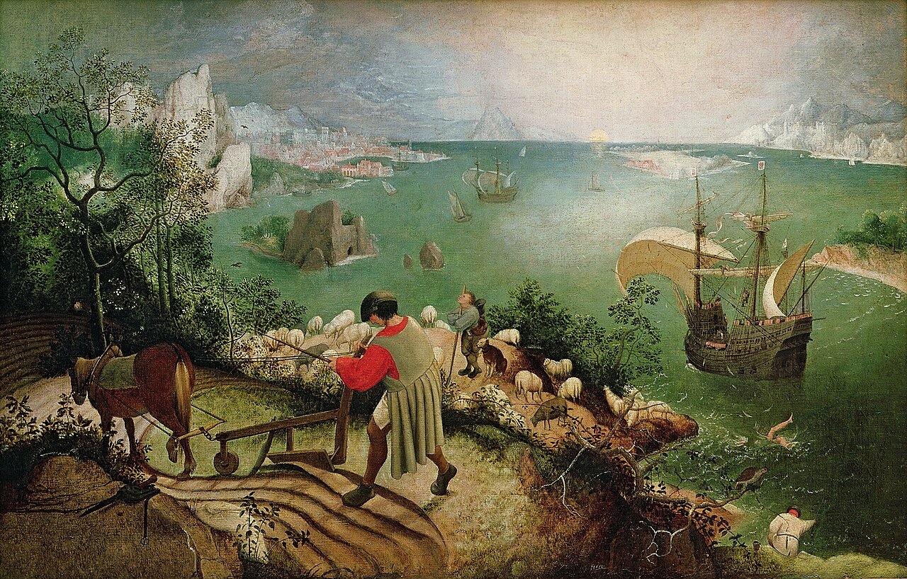

## 1. Qu’est-ce que la violence ?

| Julien Freund, _L'Essence du politique_ (1965)    |
| ---------------------------- |
| La violence est puissance corrompue ou déchaînée, ou parfois poussée volontairement à l'outrance. Non que la force serait innocente puisqu'il n'y a pas de puissance sans force, mais elle se laisse réglementer et discipliner par des for­mes, c'est-à-dire qu'elle s'exerce en général dans le res­pect des normes et conventions de la légalité. La vio­lence, par contre, instinctive et passionnelle par nature, épouvante, massacre, égorge, supplicie et bouleverse tout dans la confusion. Une armée disciplinée est l'image typique de la force, une masse soulevée et tumultueuse est celle de la violence. |
| *Question : Qu’est-ce que la violence et qu’est-ce qui la distingue de la force ?*      |

| Georges Gusdorf, *La vertu de la force* (1957)          |
| ----------------------------------------------------------- |
| La violence est cette impatience dans le rapport avec autrui, qui désespère d'avoir raison par raison et choisit le moyen le plus court pour forcer l'adhésion. Si l'ordre humain est l'ordre de la parole échangée, de l'entente par la communication, il est clair que le violent désespère de l'humain, et rompt le pacte de cette entente entre les personnes où le respect de chacun pour chacun se fonde sur la reconnaissance d'un même arbitrage en esprit et en valeur. La raison du plus fort nie l'existence d'autrui en prétendant l'asservir: la conscience faible doit devenir conscience serve, et le corps le moins fort doit être soumis à celui qui le domine. |
| *Question : En quoi la violence s’oppose-t-elle à la parole ?*      |

| Pieter Brueghel l'Ancien, “*La Chute d'Icare*” (1588)          |
| ---------------------------------------------------------------- |
|           |
| *1. Où trouve-t-on de la violence dans ce tableau ? 2. Qu’est-ce que cela nous dit de la violence ?*   |

[→ Lien vers l'image](https://upload.wikimedia.org/wikipedia/commons/c/c2/Pieter_Bruegel_de_Oude_-_De_val_van_Icarus.jpg){:target="_blank" }

{: .highlight-title }
> EXERCICE
>
> À l’aide des trois documents précédents, écrivez une définition précise du concept de violence. Commencez par faire une carte mentale, puis reprenez-en les idées pour votre définition.

