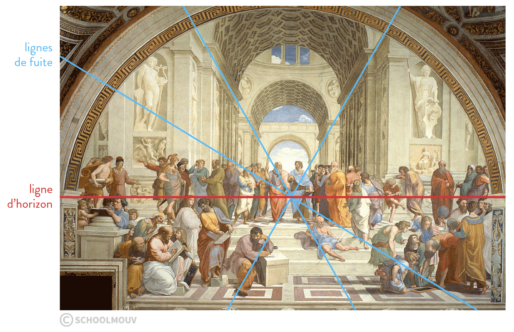
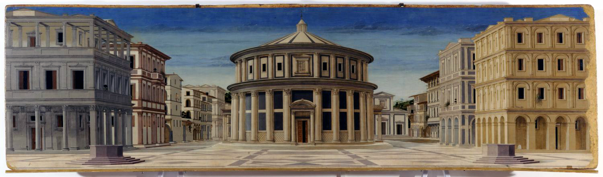

## 2.1. L’art, une image de l’éternité
{: .no_toc }

  

    Sommaire
  

  {: .text-delta }
- TOC
{:toc}

### Hannah Arendt, *La Crise de la culture*, 1963  

| Hannah Arendt, *La Crise de la culture*, 1963         |
| ---------------------------------- |
| Parmi les choses qu'on ne rencontre pas dans la nature, mais seulement dans le monde fabriqué par l'homme, on distingue entre objets d'usage et œuvre d'art ; tous deux possèdent une certaine permanence qui va de la durée ordinaire à une immortalité potentielle dans le cas excède à peine le temps nécessaire à les préparer. Du point de vue de la durée pure, les œuvres d'art sont clairement supérieures à toutes les autres choses :  elles durent plus longtemps au monde que n'importe quoi d'autre. Davantage, elles sont les seules choses à n'avoir aucune fonction dans le processus vital de la société : à proprement parler, elles ne sont pas fabriquées pour les hommes, mais pour le monde, qui est destiné à survivre à la vie limitée des mortels, au va-et-vient des générations. Non seulement elles ne sont pas consommées, ni usées comme des objets d'usage : mais elles sont délibérément écartées des procès de consommation et d'utilisation, et isolées loin de la sphère des nécessités de la vie humaine. |
| *Qu’est-ce qui différencie les « *objets d’usages* » (outils) et les « *œuvres d’art* » ?*            |

### André Bazin, _Qu'est-ce que le cinéma ?_ (1958) 

| André Bazin, _Qu'est-ce que le cinéma ?_ (1958)          |
| ------------------------------------------------------------- |
| Une psychanalyse des arts plastiques pourrait considérer la pratique de l'embaumement comme un fait fondamental de leur genèse. A l'origine de la peinture et de la sculpture, elle trouverait le « complexe » de la momie. La religion égyptienne dirigée tout entière contre la mort, faisait dépendre la survie de la pérennité matérielle du corps. Elle satisfaisait par là à un besoin fondamental de la psychologie humaine : la défense contre le temps. La mort n'est que la victoire du temps. Fixer artificiellement les apparences charnelles de l'être c'est l'arracher au fleuve de la durée : l'arrimer à la vie. Il est entendu que l'évolution parallèle de l'art et de la civilisation a dégagé les arts plastiques de ces fonctions magiques (Louis XIV ne se fait pas embaumer : il se contente de son portrait par Lebrun). Mais elle ne pouvait que sublimer à l'usage d'une pensée logique ce besoin incoercible d'exorciser le temps. On ne croit plus à l'identité ontologique du modèle et du portrait, mais on admet que celui-ci nous aide à nous souvenir de celui-là, et donc, à le sauver d'une seconde mort spirituelle. La fabrication de l'image s'est même libérée de tout utilitarisme anthropocentrique. Il ne s'agit plus de la survie de l'homme, mais plus généralement de la création d'un univers idéal à l'image du réel et doué d'un destin temporel autonome. (...) Si l'histoire des arts plastiques n'est pas seulement celle de leur esthétique mais d'abord de leur psychologie, elle est essentiellement celle de la ressemblance ou, si l'on veut, du réalisme. |
| *Quelle est la fonction principale de l’art, selon André Bazin ?*            |

### Un exemple d’innovation artistique : la perspective en peinture

{: .highlight }
> **La perspective** en peinture est une technique artistique qui permet de représenter un espace tridimensionnel sur une surface bidimensionnelle, comme une toile ou une feuille de papier. Cette technique crée l'illusion de profondeur et de volume, donnant ainsi une impression réaliste des objets et des scènes représentés. 
>
>**La perspective linéaire** est la forme la plus courante de perspective. Elle utilise des lignes de fuite qui convergent vers un ou plusieurs points de fuite situés sur la ligne d'horizon. Cette technique existe depuis l’antiquité, mais a été formalisée à la Renaissance par des artistes et architectes comme Filippo Brunelleschi et Leon Battista Alberti.

#### Illustrations

|           |
|  Lignes de fuite et point de fuite dans *L’école d’Athènes* (Raphaël, 1508 - 1512)  |    
|           |
|  *La Cité idéale à Urbino*, Francesco di Giorgio Martini et autres artistes (1480 - 1490) |   

#### Compléments vidéo : L'invention de la perspective

<iframe width="560" height="315" src="https://www.youtube.com/embed/V4miYEw61GM?si=uIUJVaFNP3sSspN5" title="YouTube video player" frameborder="0" allow="accelerometer; autoplay; clipboard-write; encrypted-media; gyroscope; picture-in-picture; web-share" referrerpolicy="strict-origin-when-cross-origin" allowfullscreen></iframe>

<iframe width="560" height="315" src="https://www.youtube.com/embed/6XTaxcQdTVM?si=HdAQxJ46Qj7ofyaJ" title="YouTube video player" frameborder="0" allow="accelerometer; autoplay; clipboard-write; encrypted-media; gyroscope; picture-in-picture; web-share" referrerpolicy="strict-origin-when-cross-origin" allowfullscreen></iframe>

#### Leon Battista Alberti, *De pictura* (1540)

| Leon Battista Alberti, *De pictura* (1540)                     |
| --------------------------------------------- |
| La tâche du peintre consiste à utiliser des lignes et des couleurs pour inscrire et peindre sur une surface toutes sortes de corps donnés, de manière telle qu’à une distance précise, et une fois établie avec précision la position du rayon de centre, tout ce que tu vois peint paraisse en relief et entièrement semblable aux corps donnés. […] Je désire que le peintre, pour maîtriser parfaitement tout cela, soit avant tout un homme de bien et versé dans les disciplines libérales. […] À cet égard je désire surtout qu’il soit savant en géométrie. […] Ensuite, il ne sera pas déplacé que les peintres trouvent du charme aux poètes et aux orateurs : car ceux-ci partagent bien des ornements avec le peintre. Et ils seront d’un grand secours, ces lettrés qui fournissent à foison des connaissances sur quantité de choses, pour bien organiser la composition de l’histoire représentée, dont l’invention fait le principal mérite. |
| *Pourquoi, selon Alberti, le peintre doit-il aussi être géomètre ?*            |

