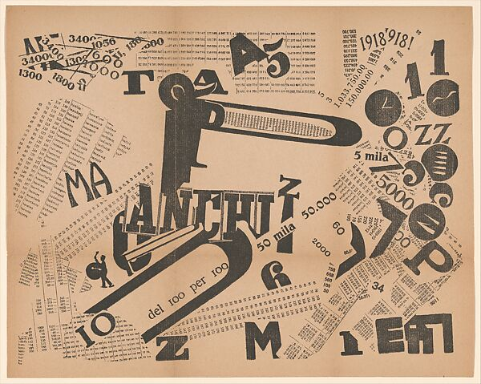
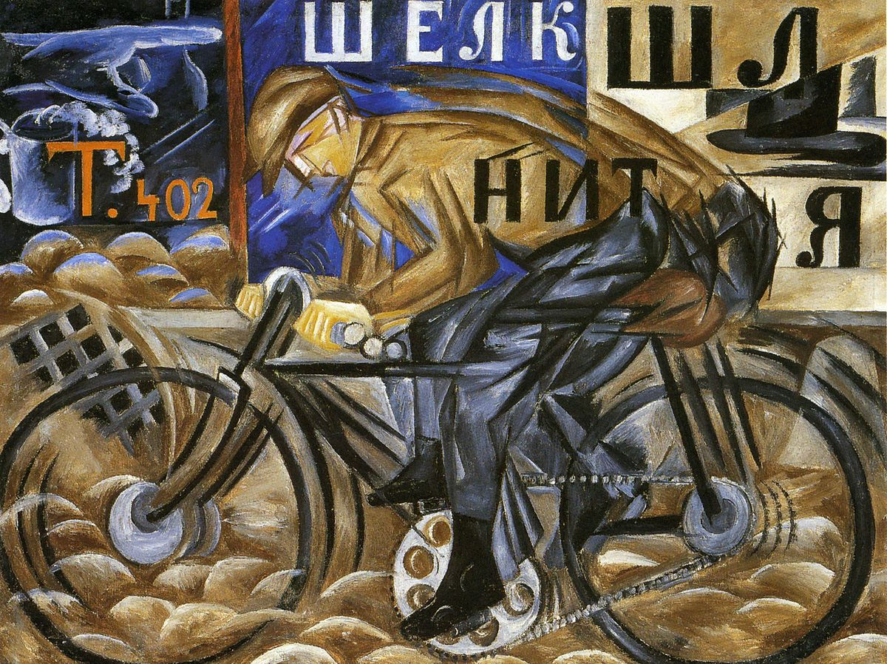
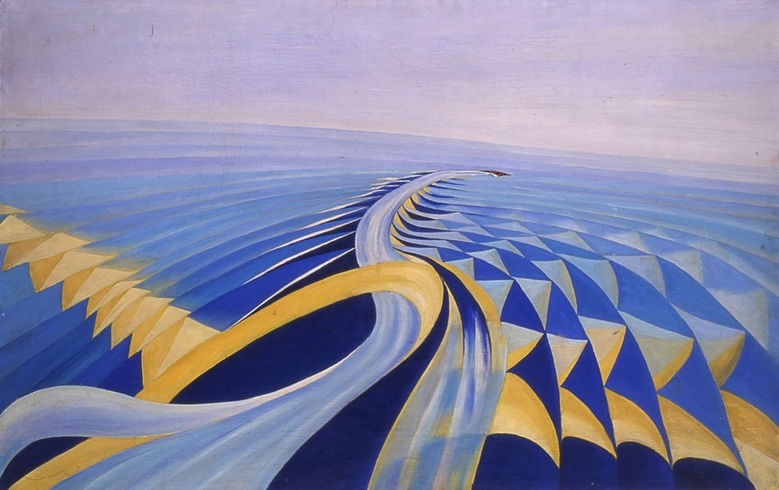
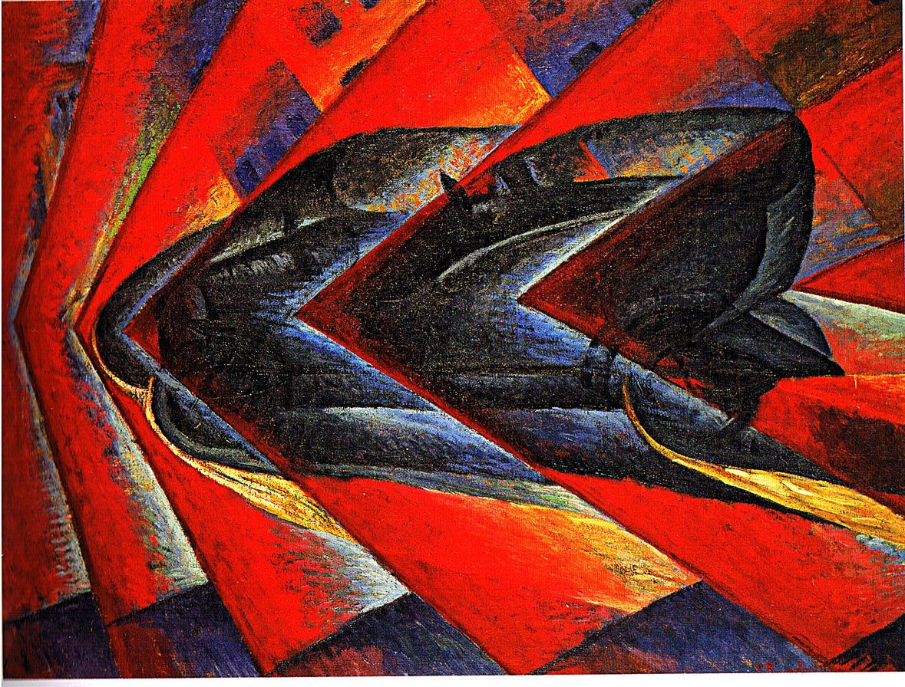

## 3.1. Futurisme et fascisme
{: .no_toc }

  

    Sommaire
  

  {: .text-delta }
- TOC
{:toc}

{: .highlight-title }
Le **futurisme**, mouvement artistique d'avant-garde fondé en 1909 par Filippo Tommaso Marinetti, partageait avec le fascisme naissant une idéologie nationaliste, une glorification de la guerre et de la violence, un rejet de la démocratie parlementaire et un désir de changement radical et de modernité. Marinetti et de nombreux futuristes ont soutenu le fascisme à ses débuts, voyant des parallèles avec leurs propres idées. Marinetti a fondé le Parti Politique Futuriste en 1918 qui a fusionné avec les Faisceaux italiens de combat de Mussolini en 1919. Certains futuristes ont pris leurs distances avec le fascisme dans les années 1920 quand celui-ci a pris un tournant plus réactionnaire et moins révolutionnaire.

### Œuvres

|    |  |
| ------------------------------------------------------------ | ----------------------------------------------- |
| Filippo Tommaso Marinetti, _Une assemblée tumultueuse_, 1919 | Natalya Goncharova, *Ciclista*, 1913            |
|    |   |
| Benedetta, *Velocità  di motoscafo*, 1919-1924               | Luigi Russolo, *Dynamisme d’une voiture*, 1913  |

### Compléments vidéo : Qu'est-ce que le futurisme ?

<iframe width="560" height="315" src="https://www.youtube.com/embed/YFPIP9NxU30?si=c9PsVVNs1ADzszlv" title="YouTube video player" frameborder="0" allow="accelerometer; autoplay; clipboard-write; encrypted-media; gyroscope; picture-in-picture; web-share" referrerpolicy="strict-origin-when-cross-origin" allowfullscreen></iframe>

<iframe width="560" height="315" src="https://www.youtube.com/embed/DkjYH-l3sl4?si=iQCu8npNEotf9JG8" title="YouTube video player" frameborder="0" allow="accelerometer; autoplay; clipboard-write; encrypted-media; gyroscope; picture-in-picture; web-share" referrerpolicy="strict-origin-when-cross-origin" allowfullscreen></iframe>

### Manifeste

| Filippo T. Marinetti (1876-1944), *Manifeste du futurisme*               |
| ------------------------------------------------------------------------------------------ |
| Nous voulons chanter l’amour du danger, l’habitude de l’énergie et de la témérité. Les éléments essentiels de notre poésie seront le courage, l’audace et la révolte. (...) Nous voulons chanter l’homme qui tient le volant, dont la tige idéale traverse la terre, lancée elle-même sur le circuit de son orbite. (...) Il n’y a plus de beauté que dans la lutte. Pas de chef-d’œuvre sans un caractère agressif. La poésie doit être un assaut violent contre les forces inconnues, pour les sommer de se coucher devant l’homme. (...) Nous voulons démolir les musées, les bibliothèques, combattre le moralisme, le féminisme et toutes les lâchetés opportunistes et utilitaires. Nous chanterons les grandes foules agitées par le travail, le plaisir ou la révolte ; les ressacs multicolores et polyphoniques des révolutions dans les capitales modernes ; la vibration nocturne des arsenaux et des chantiers sous leurs violentes lunes électriques ; les gares gloutonnes avaleuses de serpents qui fument ; les usines suspendues aux nuages par les ficelles de leurs fumées ; les ponts aux bonds de gymnastes lancés sur la coutellerie diabolique des fleuves ensoleillés ; les paquebots aventureux flairant l’horizon ; les locomotives au grand poitrail qui piaffent sur les rails, tels d’énormes chevaux d’acier bridés de longs tuyaux et le vol glissant des aéroplanes, dont l’hélice a des claquements de drapeaux et des applaudissements de foule enthousiaste. |

| Filippo T. Marinetti _Nécessité cosmique de la guerre_ (1935)         |
| ------------------------------------------------------------------------------------ |
| La guerre est belle, parce que, grâce au masque à gaz, au terrifiant mégaphone, aux lance-flammes et aux petits chars d’assaut, elle fonde la souveraineté de l’homme sur la machine subjuguée. La guerre est belle, parce qu’elle réalise pour la première fois le rêve d’un homme au corps métallique. La guerre est belle, parce qu’elle enrichit un pré en fleur des orchidées flamboyantes que sont les mitrailleuses. |

