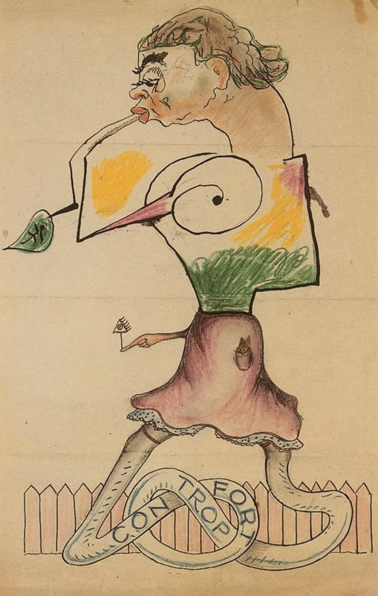
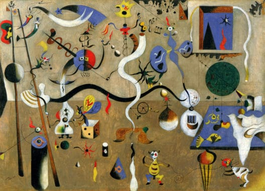
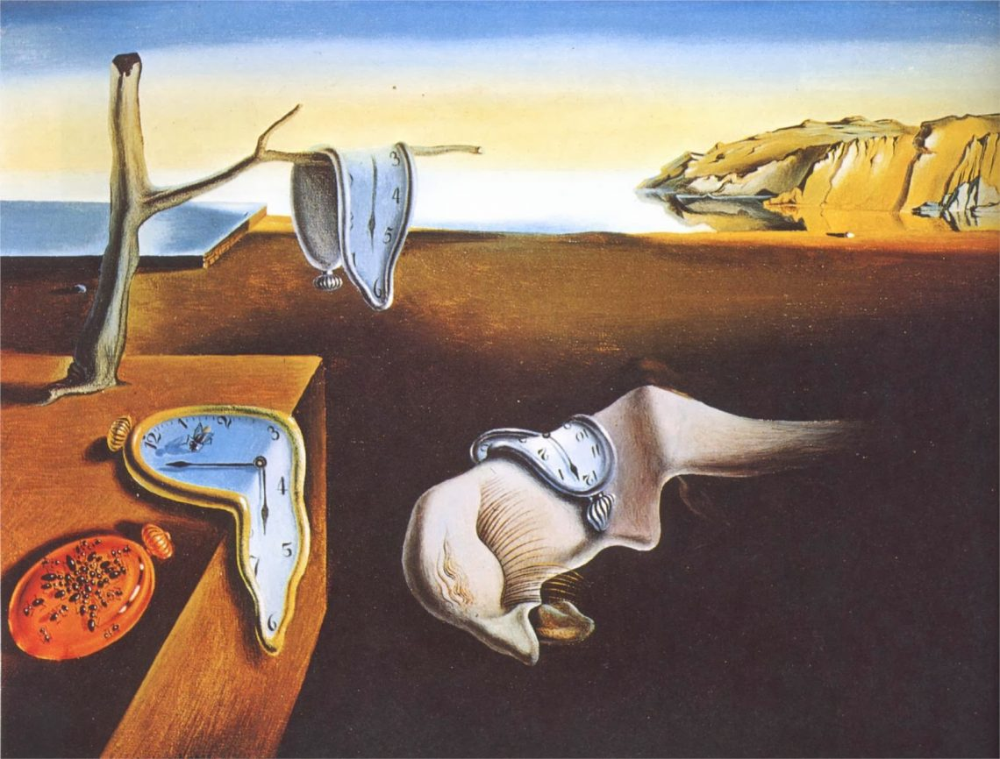
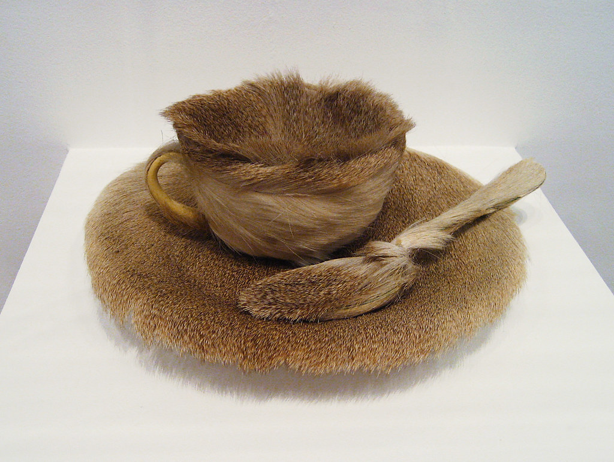

## 3.2. Surréalisme et Communisme
{: .no_toc }

  

    Sommaire
  

  {: .text-delta }
- TOC
{:toc}

{: .highlight-title }
Le **surréalisme**, mouvement artistique d’avant-garde fondé par André Breton, a entretenu des relations proches mais conflictuelles avec le communisme. Le surréalisme, inspiré de la psychanalyse inventée par Sigmund Freud, visait à libérer l'esprit humain des contraintes rationnelles et sociales par l'exploration de l'inconscient et des rêves. En 1927, plusieurs surréalistes ont rejoint le Parti communiste français (PCF), cherchant à aligner leur quête de révolution culturelle avec la révolution sociale prônée par le communisme. Mais les surréalistes valorisaient l'irrationalité et l'automatisme psychique, tandis que le communisme mettait l'accent sur la réalité matérielle et la lutte des classes. Cette divergence a conduit à des conflits internes au mouvement surréaliste et à des ruptures, notamment lorsque Breton a été expulsé du PCF en 1933.

### Œuvres

|   |   |
| ------------------------------------------------------------------- | ------------------------------------------------ |
| Joan Miró, Yves tanguy, Man Ray, Max Morise, *Cadavre exquis*, 1927 | Joan Miró, _Le Carnaval d’Arlequin_, 1924-1925  |
|   | |
| Salvador Dalí, *La Persistance de la mémoire*, 1931                | Meret Oppenheim, _Le Déjeuner en fourrure_, 1936 |

### Manifeste

| André Breton, *Manifeste du surréalisme* (1924)              |
| ---------------------------------------------------------------------------------- |
| C’est de très mauvaise foi qu’on nous contesterait le droit  d’employer le mot Surréalisme dans le sens très particulier où  nous l’entendons, car il est clair qu’avant nous ce mot n’avait  pas fait fortune. Je le définis donc une fois pour toutes : - Surréalisme, n. m. Automatisme psychique pur par lequel on se  propose d’exprimer, soit verbalement, soit par écrit, soit de  toute autre manière, le fonctionnement réel de la pensée. Dictée  de la pensée, en l’absence de tout contrôle exercé par la raison, en dehors de toute préoccupation esthétique ou morale. - Le surréalisme repose sur la croyance à la réalité supérieure de certaines formes d’associations négligées jusqu’à lui, à la toute-puissance du rêve, au jeu désintéressé de la  pensée. Il tend à ruiner définitivement tous les autres mécanismes  psychiques et à se substituer à eux dans la résolution des  principaux problèmes de la vie. |
| De l’instant où il sera soumis à un examen méthodique, où, par des moyens à déterminer, on parviendra à nous rendre compte du rêve dans son intégrité (et cela suppose une discipline de la mémoire qui porte sur des générations ; commençons tout de même par enregistrer les faits saillants), où sa courbe se développera avec une régularité et une ampleur sans pareilles, on peut espérer que les mystères qui n’en sont pas feront place au grand Mystère. Je crois à la résolution future de ces deux états, en apparence si contradictoires, que sont le rêve et la réalité, en une sorte de réalité absolue, de surréalité, si l’on peut ainsi dire. C’est à sa conquête que je vais, certain de n’y pas parvenir mais trop insoucieux de ma mort pour ne pas supputer un peu les joies d’une telle possession. […] Il y aurait encore beaucoup à dire mais, chemin faisant, je n’ai voulu qu’effleurer un sujet qui nécessiterait à lui seul un exposé très long et une tout autre rigueur ; j’y reviendrai. Pour cette fois, mon intention était de faire justice de la haine du merveilleux qui sévit chez certains hommes, de ce ridicule sous lequel ils veulent le faire tomber. Tranchons-en : le merveilleux est toujours beau, n’importe quel merveilleux est beau, il n’y a même que le merveilleux qui soit beau. |

### Complément vidéos

#### Qu'est-ce que le surréalisme ?

<iframe width="560" height="315" src="https://www.youtube.com/embed/KAgvZCcJM1k?si=oO593R7cG7V5xQYT" title="YouTube video player" frameborder="0" allow="accelerometer; autoplay; clipboard-write; encrypted-media; gyroscope; picture-in-picture; web-share" referrerpolicy="strict-origin-when-cross-origin" allowfullscreen></iframe>

#### Comprendre le surréalisme

<iframe width="560" height="315" src="https://www.youtube.com/embed/So9wxAVmsa4?si=DibKDn6_XyvwBGMV" title="YouTube video player" frameborder="0" allow="accelerometer; autoplay; clipboard-write; encrypted-media; gyroscope; picture-in-picture; web-share" referrerpolicy="strict-origin-when-cross-origin" allowfullscreen></iframe>

#### Le dadaïsme, à l'origine du surréalisme

<iframe width="560" height="315" src="https://www.youtube.com/embed/hUbP2Ae-miU?si=AIr0p9InekIkHh-C" title="YouTube video player" frameborder="0" allow="accelerometer; autoplay; clipboard-write; encrypted-media; gyroscope; picture-in-picture; web-share" referrerpolicy="strict-origin-when-cross-origin" allowfullscreen></iframe>

#### André Breton raconte et explique le mouvement surréaliste

<iframe width="560" height="315" src="https://www.youtube.com/embed/wppj0h1_OXc?si=76STXP6yDP1rUSRr" title="YouTube video player" frameborder="0" allow="accelerometer; autoplay; clipboard-write; encrypted-media; gyroscope; picture-in-picture; web-share" referrerpolicy="strict-origin-when-cross-origin" allowfullscreen></iframe>